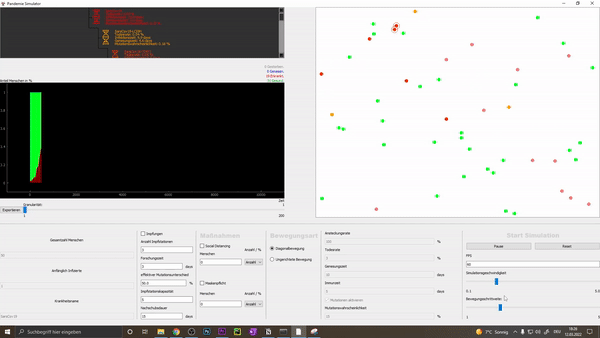

# Pandemic Simualtor
I made this over the course of my third semester as practical part of my Bachelor's Degree.

Includes live moving particles, measures like vaccines or social distancing and ajustable disease/mutation settings. 

The live graph shows infection/recovered/healthy rates and lets you export the data as a csv file.

 
# Maintenance
Note: This project is not maintained anymore and hasn't been updated since completion in early 2021.
